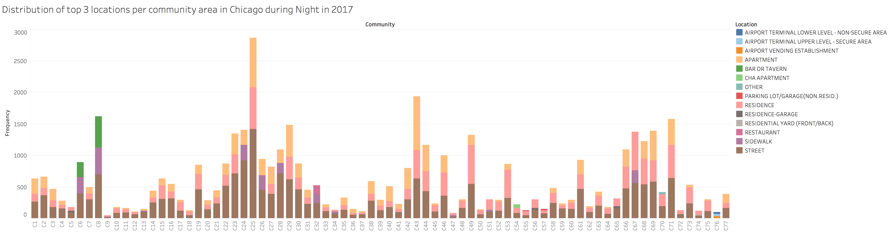
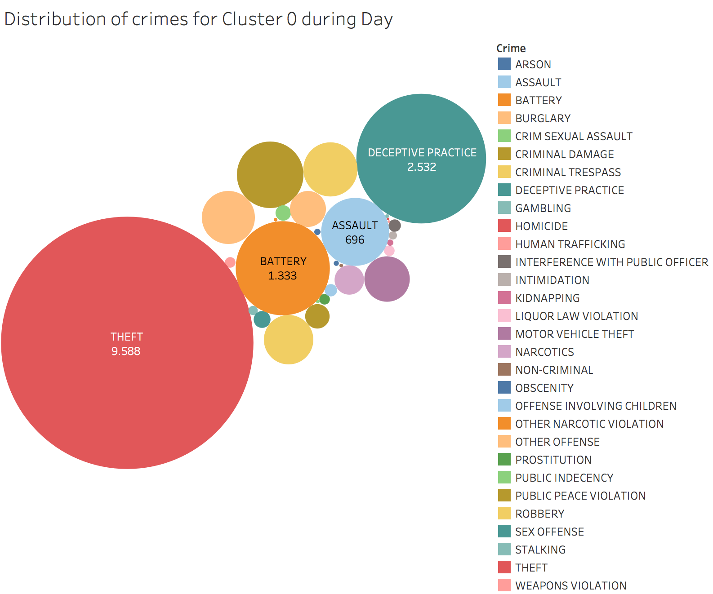

# Analysis of crimes and locations during daytime and night-time in 2017

For this analysis, we wanted to investigate if there exists a clear difference between the crimes commited at day and night during 2017, as well as for their locations. This helps us to address two tasks of our analysis. Firstly, we want to give insights of dominant locations among the communities so that the police departement can distribute the manpower in a more specific way depending on the time of the day. Secondly, we aim to group the communities by similar criminal activity based on locations or crimes.

## Methodology

First, an study of the frequency of locations per community during day and night - separately - was performed to detect dominant elements as well as differences and similarities between communities. For this, a day includes the hours from 6:00:00 to 20:59:59 and night from 21:00:00 to 5:59:00. After that, the top 3 locations per community were analyzed for each period of time. Next, we ran a k-means clustering based on the frequency of locations per community and compared with a similar clustering based on the crimes frequency instead. As a result, we propose a final clustering and suggestions of specific areas to focus on.

## Results

### Locations

| All locations during day | All locations during night |
|:--------------------------------:|:-----------------:|
|  |  | 

| Top 3 locations |
|:--------------------------------:|
|  |
|  | 

### Crimes

| Clustering crimes day | Clustering crimes night |
|:--------------------------------:|:-----------------:|
|  |  | 

| Clusters Day | Clusters Night |
|:--------------------------------:|:-----------------:|
|  |  | 
|  |  | 
|  |  | 

## Conclusions

First of all, no clear difference can be seen with respect to the time of the day among the communities. In general, regardless the time, Battery, Theft and Criminal Damage are the most frequent crimes in Chicago and it is not surprising that Street, Residence and Appartement appear to be the most frequent locations. In particular, community 25 had the highest number of crimes of these categories, community 76 has mostly airport related crimes Community 8 is the only community showing a difference between crimes at day and night with Departement Store and Restaurant crimes during day and Bar and Sidewalk during night.

Secondly, while clustering the communities we have found that choosing criminal activity as the criteria gives a similar result than picking locations as criteria, however we decide on criminal activity due to the smaller number of features (33 with type of crime vs. 170+ with locations where only a few are dominant). This clusters suggest that during day, there are communities with a low number of crimes and two other with high numbers, being the incidences of narcotics one of the most outstanding differences between these last two clusters. During night, there is a cluster with Theft as dominant crime, one other with Battery and the last one with Criminal Damage but still, narcotics appear to have certain dominance in only one cluster. This clusters are close to the results derived in our narcotics analysis.

## For the poster

- Three main crimes to focus on: Battery, Theft and Criminal Damage.
- Three main locations where the police should put more attention: Street, Residence and Appartement.
- C25 and C43 require to pay special attention to the criminal activity.
- Clustering algorithm threw 3 clusters for which one seems to contain narcotics related crimes, other contains communities with different crimes that the rest of the communities and the others are included in the remaining cluster.

## Pics for the poster

- Bar plots of top 3 loctions
- Cluster maps per day and night
- Cluster 2 day
- Cluster 1 night